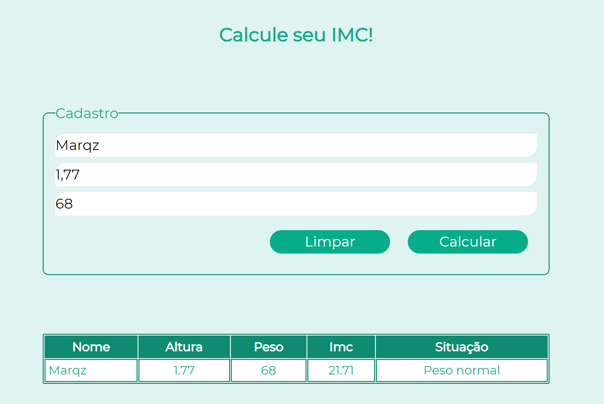
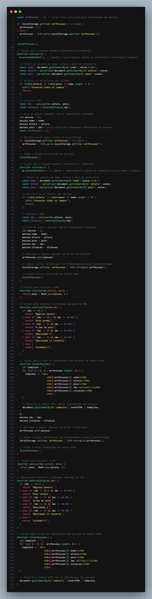

# Projeto Calculadora de IMC

## Descrição
Este é um projeto simples de uma calculadora de Índice de Massa Corporal (IMC) com armazenamento local. Ele permite aos usuários calcular seu IMC, salvar os resultados e visualizá-los em uma tabela.

## Como Usar
1. Abra o arquivo HTML no seu navegador.
2. Preencha o formulário com o nome, altura e peso.
3. Clique no botão "Calcular" para calcular o IMC.
4. Os resultados serão exibidos na tabela abaixo do formulário.
5. Os dados dos usuários serão armazenados localmente, então você não perderá as informações após recarregar a página.

## Screenshots
Aqui estão algumas capturas de tela do projeto:

1. 
2. 

## Links
- [Repositório GitHub](https://github.com/Marqzzs/Projeto-IMC)
- [Vercel](https://projeto-imc-tan.vercel.app/)

Feito por [Marqz](https://github.com/Marqzzs)
